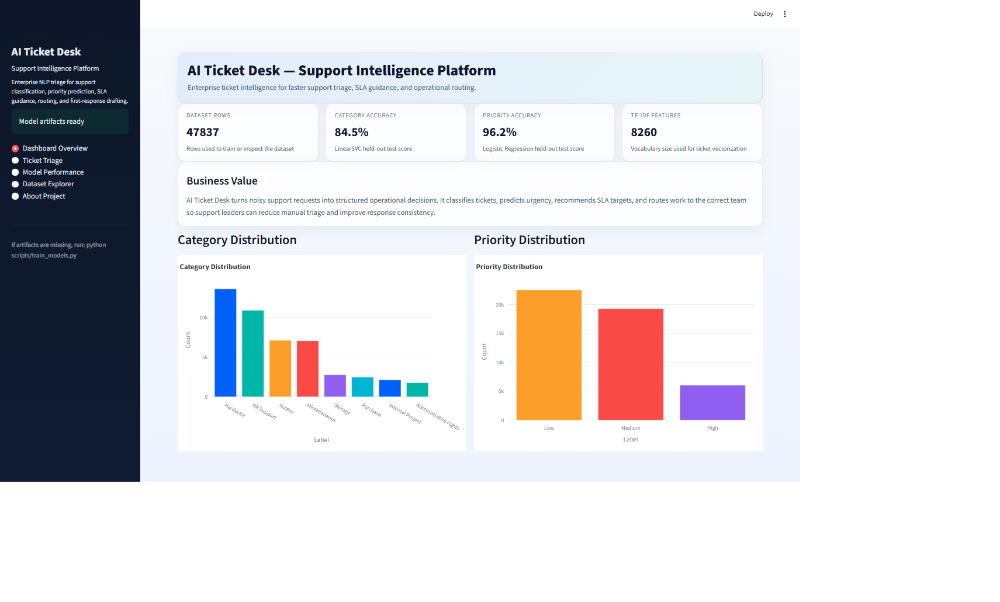
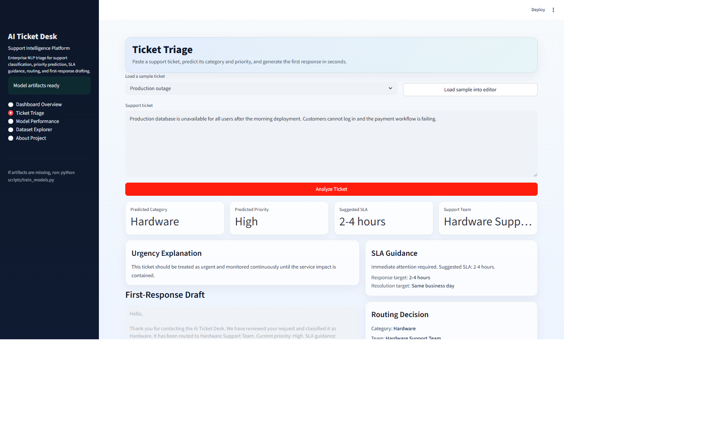
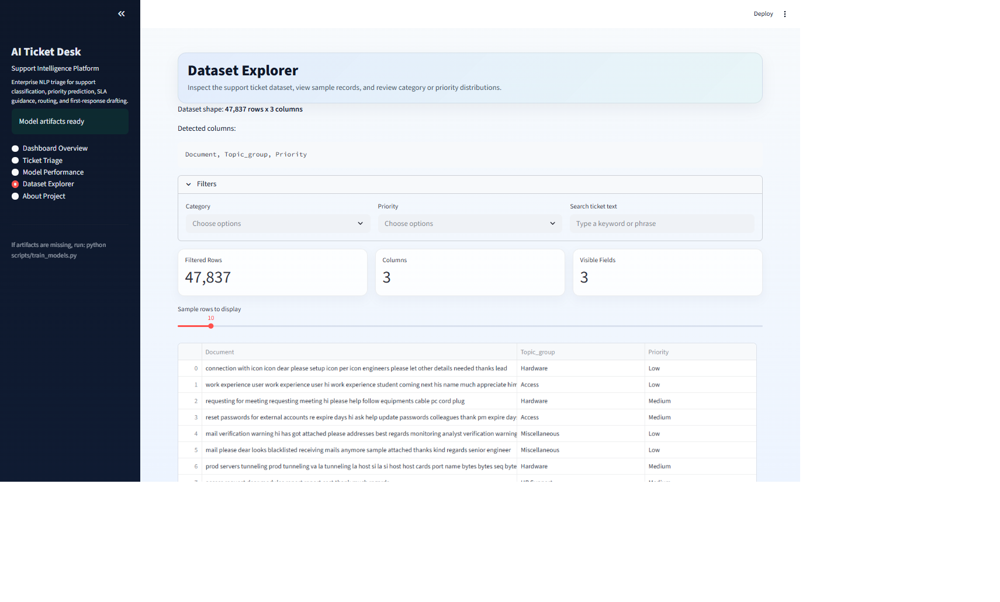
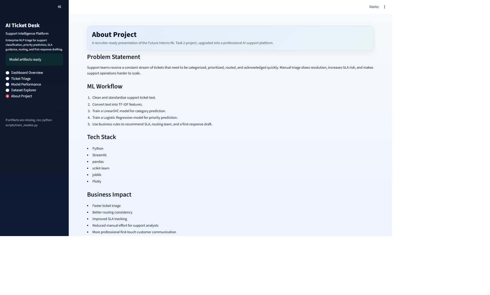

# AI Ticket Desk — Support Intelligence Platform


AI Ticket Desk is a recruiter-ready NLP support automation project that upgrades Future Interns Machine Learning Internship Task 2 into a professional simulation of an enterprise IT helpdesk AI platform. It classifies support tickets, predicts priority, recommends SLA guidance, routes requests to the right team, and generates first-response drafts through a clean Streamlit dashboard.

## Business Problem

Support teams often receive large volumes of unstructured tickets that must be triaged quickly. Manual classification, prioritization, and routing slows down response times, introduces inconsistency, and makes it harder to identify SLA risks early.

## Project Objective

The objective of this project is to automate first-line ticket triage with machine learning so that support requests can be categorized, prioritized, and routed more efficiently while still producing a professional and explainable workflow for stakeholders.

## Key Features

- Ticket category classification with a LinearSVC model.
- Ticket priority prediction with Logistic Regression.
- SLA guidance based on predicted urgency.
- Rule-based support team routing.
- Professional first-response draft generation.
- Clean Streamlit dashboard with multiple pages.
- Dataset explorer and model performance views.
- Beginner-friendly launcher and health checker in `main.py`.

## Dataset

- File: `data/all_tickets_processed_improved_v3.csv`
- Size: around 47,837 rows
- Main text column: `Document`
- Main category column: `Topic_group`
- Priority labels are either taken from the dataset or generated using rule-based keyword logic when needed.

## Machine Learning Workflow

1. Load and validate the dataset.
2. Detect the text and category columns automatically.
3. Clean support ticket text.
4. Generate priority labels when the source column is unavailable.
5. Transform text using a TF-IDF vectorizer.
6. Train a LinearSVC model for category prediction.
7. Train a Logistic Regression model for priority prediction.
8. Evaluate models using a train/test split.
9. Save model artifacts and a JSON training report.
10. Load the saved artifacts in the Streamlit dashboard for interactive analysis.

## Model Performance

The saved local training report shows strong support triage performance:

- Category accuracy: approximately 84.5% to 85%+
- Priority accuracy: approximately 96% to 97%
- TF-IDF features: 10,000 configured in the training pipeline

These results make the project suitable as a realistic internship simulation rather than a production deployment claim.

## Dashboard Features

The Streamlit app at `app/app.py` includes:

- Dashboard Overview with KPI cards and distribution charts.
- Ticket Triage for interactive prediction and response drafting.
- Model Performance for accuracy and classification report review.
- Dataset Explorer for sample rows, filters, and distribution analysis.
- About Project for a concise business and ML summary.

## Project Structure

```text
AI-Ticket-Desk-Support-Intelligence-Platform/
├── app/
│   └── app.py
├── data/
│   └── all_tickets_processed_improved_v3.csv
├── models/
│   ├── category_model.pkl
│   ├── model_report.json
│   ├── priority_model.pkl
│   └── tfidf_vectorizer.pkl
├── notebooks/
│   └── 01_ticket_classification_model.ipynb
├── scripts/
│   └── train_models.py
├── visuals/
├── main.py
├── README.md
└── requirements.txt
```

## Installation

### 1. Create a virtual environment

```powershell
python -m venv .venv
```

### 2. Activate it on Windows PowerShell

```powershell
.venv\Scripts\Activate.ps1
```

### 3. Install dependencies

```powershell
pip install -r requirements.txt
```

## Training Command

```powershell
python scripts/train_models.py
```

## Run the Dashboard

```powershell
streamlit run app/app.py
```

## Screenshots







## Results and Business Impact

- Reduces manual triage effort for support teams.
- Improves consistency in ticket routing and prioritization.
- Helps surface SLA-sensitive requests faster.
- Produces a more professional first-touch experience for support users.
- Demonstrates practical machine learning product thinking for recruiters.

## Future Improvements

- Add richer explainability visuals for model decisions.
- Include batch upload/export workflows for support operations.
- Add more routing rules for department-specific queues.
- Explore transformer-based text classification for future model iterations.
- Add test coverage and simple CI checks for the training and app scripts.

## Author

**A.J. Pardhiv**

- AI & Data Science Student
- Google Certified Data Analyst
- Full-Stack Developer | Python & ML Enthusiast

## Closing Note

This repository is an internship project upgraded into a professional simulation of an enterprise support automation platform. It is intentionally positioned as a recruiter-ready machine learning product demo rather than a claim of live production deployment.
