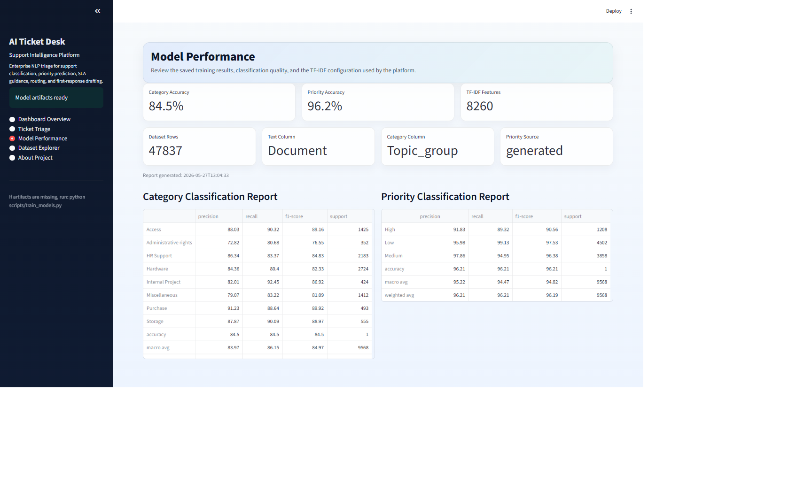
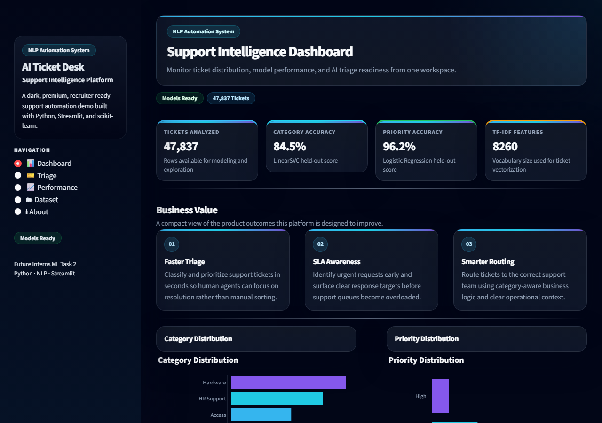

# AI Ticket Desk — Support Intelligence Platform


> A professional NLP-based support automation dashboard for ticket classification, priority prediction, SLA guidance, team routing, and first-response generation.

AI Ticket Desk is a recruiter-ready NLP support automation project that upgrades Future Interns Machine Learning Internship Task 2 into a professional simulation of an enterprise IT helpdesk AI platform. It classifies support tickets, predicts priority, recommends SLA guidance, routes requests to the right team, and generates first-response drafts through a clean Streamlit dashboard.

## Business Problem

Support teams often receive large volumes of unstructured tickets that must be triaged quickly. Manual classification, prioritization, and routing slows down response times, introduces inconsistency, and makes it harder to identify SLA risks early.

## Project Objective

The objective of this project is to automate first-line ticket triage with machine learning so that support requests can be categorized, prioritized, and routed more efficiently while still producing a professional and explainable workflow for stakeholders.

## Key Features

- Ticket category classification with a LinearSVC model.
- Ticket priority prediction with Logistic Regression.
- SLA guidance based on predicted urgency.
- Rule-based support team routing.
- Professional first-response draft generation.
- Clean Streamlit dashboard with multiple pages.
- Dataset explorer and model performance views.
- Beginner-friendly launcher and health checker in `main.py`.

## Dataset

- File: `data/all_tickets_processed_improved_v3.csv`
- Size: around 47,837 rows
- Main text column: `Document`
- Main category column: `Topic_group`
- Priority labels are either taken from the dataset or generated using rule-based keyword logic when needed.

## Machine Learning Workflow

1. Load and validate the dataset.
2. Detect the text and category columns automatically.
3. Clean support ticket text.
4. Generate priority labels when the source column is unavailable.
5. Transform text using a TF-IDF vectorizer.
6. Train a LinearSVC model for category prediction.
7. Train a Logistic Regression model for priority prediction.
8. Evaluate models using a train/test split.
9. Save model artifacts and a JSON training report.
10. Load the saved artifacts in the Streamlit dashboard for interactive analysis.

## Model Performance

The saved local training report shows strong support triage performance:

- Category accuracy: approximately 84.5% to 85%+
- Priority accuracy: approximately 96% to 97%
- TF-IDF features: 10,000 configured in the training pipeline

These results make the project suitable as a realistic internship simulation rather than a production deployment claim.

## Dashboard Features

The Streamlit app at `app/app.py` includes:

- Dashboard Overview with KPI cards and distribution charts.
- Ticket Triage for interactive prediction and response drafting.
- Model Performance for accuracy and classification report review.
- Dataset Explorer for sample rows, filters, and distribution analysis.
- About Project for a concise business and ML summary.

## Project Structure

```text
AI-Ticket-Desk-Support-Intelligence-Platform/
├── app/
│   └── app.py
├── data/
│   └── all_tickets_processed_improved_v3.csv
├── models/
│   ├── category_model.pkl
│   ├── model_report.json
│   ├── priority_model.pkl
│   └── tfidf_vectorizer.pkl
├── notebooks/
│   └── 01_ticket_classification_model.ipynb
├── scripts/
│   └── train_models.py
├── visuals/
├── main.py
├── README.md
└── requirements.txt
```

## Installation

### 1. Create a virtual environment

```powershell
python -m venv .venv
```

### 2. Activate it on Windows PowerShell

```powershell
.venv\Scripts\Activate.ps1
```

### 3. Install dependencies

```powershell
pip install -r requirements.txt
```

## Training Command

```powershell
python scripts/train_models.py
```

## Run the Dashboard

```powershell
streamlit run app/app.py
```

## Screenshots

### Dashboard Overview


The dashboard overview highlights dataset size, model accuracy, TF-IDF feature count, business value, category distribution, and priority distribution.

### Ticket Triage


The ticket triage page analyzes a support request and displays the predicted category, priority level, SLA guidance, suggested support team, urgency explanation, and first-response draft.

### Model Performance


The model performance page summarizes category accuracy, priority accuracy, dataset details, TF-IDF features, and classification reports.

### Dataset Explorer


The dataset explorer provides sample records, dataset shape, column information, category counts, and priority distribution insights.

### About Project


The about page explains the problem statement, machine learning workflow, technology stack, and expected business impact of the support automation system.

## How to Use

1. Install the required dependencies using `pip install -r requirements.txt`.
2. Train the machine learning models using `python scripts/train_models.py`.
3. Start the Streamlit dashboard using `streamlit run app/app.py`.
4. Open the **Ticket Triage** page from the sidebar.
5. Enter a support ticket description in the text box.
6. Click **Analyze Ticket**.
7. Review the predicted category, priority level, SLA guidance, suggested support team, urgency explanation, and generated first-response draft.

## Results and Business Impact

This project demonstrates how machine learning can support first-level IT helpdesk operations by reducing manual triage effort and improving ticket routing consistency.

Key outcomes include:

- Automatically classifies support tickets into relevant issue categories.
- Predicts priority levels to support SLA-based decision-making.
- Routes tickets to the appropriate support team using rule-based business logic.
- Generates professional first-response drafts for faster support communication.
- Provides an interactive dashboard for reviewing dataset insights and model performance.
- Demonstrates practical NLP, machine learning, and product-thinking skills in an internship-level project.

This project is designed as a professional simulation of an enterprise support automation workflow, not as a live production deployment.

## Future Improvements

- Add model explainability using feature importance or LIME/SHAP-style explanations.
- Include batch ticket upload and export functionality for support teams.
- Add role-based dashboard views for agents, managers, and administrators.
- Improve priority prediction using richer historical SLA or resolution-time data.
- Experiment with transformer-based text classification models such as BERT.
- Add automated testing for the training pipeline and Streamlit dashboard.
- Deploy the Streamlit dashboard using Streamlit Community Cloud or another hosting platform.

## Author

**A.J. Pardhiv**

- AI & Data Science Student  
- Google Certified Data Analyst  
- Full-Stack Developer  
- Python & Machine Learning Enthusiast  
- Interested in AI, Data Science, NLP, and intelligent automation systems

## Closing Note

AI Ticket Desk is an internship machine learning project upgraded into a professional simulation of an enterprise IT support automation platform. It is intended to demonstrate practical NLP, model training, dashboard development, and business workflow design rather than claim real-world production deployment.
